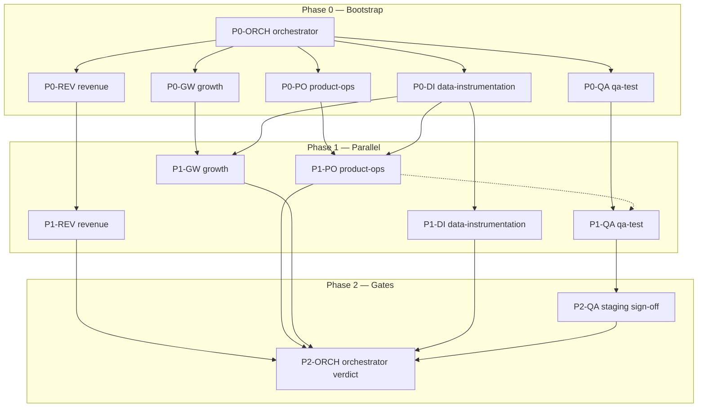

# DataSpark — Execution DAG & Critical Path

**As-of:** 2026-04-02

---

## Legend

- **Solid edges:** hard dependency (downstream blocked until upstream done)  
- **Dashed edges:** soft dependency (can start with assumptions; reconcile later)  
- **Red:** critical path for **staging readiness**

---

## Mermaid — Phases 0–2

---

## Critical path (staging GO)

The longest path to **P2-ORCH** (staging verdict):

1. **P0-ORCH** → **P0-PO** → **P1-PO** (staging deploy + env documented)  
2. **P0-QA** → **P1-QA** → **P2-QA** (staging sign-off)  

**Data path** (parallel but often blocking growth measurement):

- **P0-DI** → **P1-DI** → **P2-ORCH**

**Growth experiments** are not on the critical path for *staging* unless launch requires specific experiments.

---

## Parallelism (maximize)

| After | Run in parallel |
|-------|-----------------|
| P0-ORCH | P0-PO, P0-GW, P0-QA, P0-DI, P0-REV |
| P0 complete | P1-PO, P1-GW, P1-QA (blocked on staging URL from P1-PO), P1-DI, P1-REV |
| P1 complete | P2-QA + orchestrator prep → **P2-ORCH** |

---

## Critical path — full program (Phase 3+)

Not started in this execution. Expected bottleneck (from `AGENT-TASKS.md`):

**Curriculum breadth** → **Frontend integration** → **Review/assembly** → **Deploy**

Details will be appended when Phase 2 completes.
