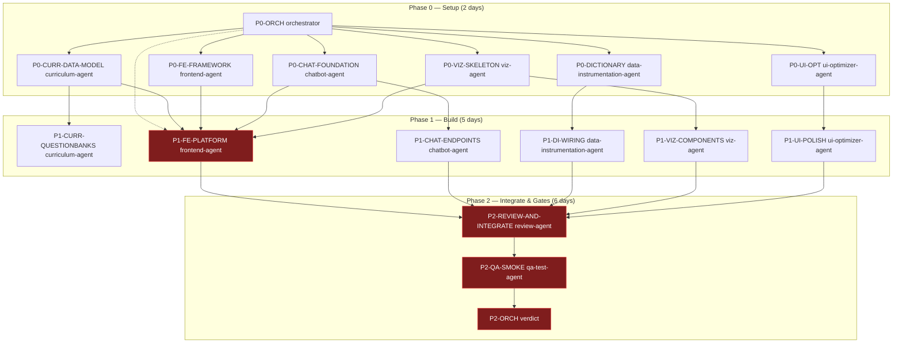

# DataSpark — Execution DAG & Critical Path (Phase 0–2 Platform Build)

**As-of:** 2026-04-03

---

## Legend

- **Solid edges:** hard dependency (downstream blocked until upstream done)
- **Dashed edges:** soft dependency (can start with assumptions; reconcile later)
- **Red:** critical path for **staging readiness**

---

## Mermaid — Phase 0–2

---

## Critical Path (staging readiness)

The longest hard dependency chain to the Phase 2 verdict:

1. `P0-FE-FRAMEWORK` + `P0-CURR-DATA-MODEL` + `P0-CHAT-FOUNDATION` (and parallel viz/DI/UI)  
2. `P1-FE-PLATFORM` → `P2-REVIEW-AND-INTEGRATE` → `P2-QA-SMOKE` → `P2-ORCH`

If AI endpoints (`P1-CHAT-ENDPOINTS`) slip, `P1-FE-PLATFORM` and downstream gates are blocked by missing real tutor/evaluation wiring. `P1-FE-PLATFORM` also gates on `/platform` routing + `/dashboard` redirect + secure tutor calls (no Anthropic from browser).
